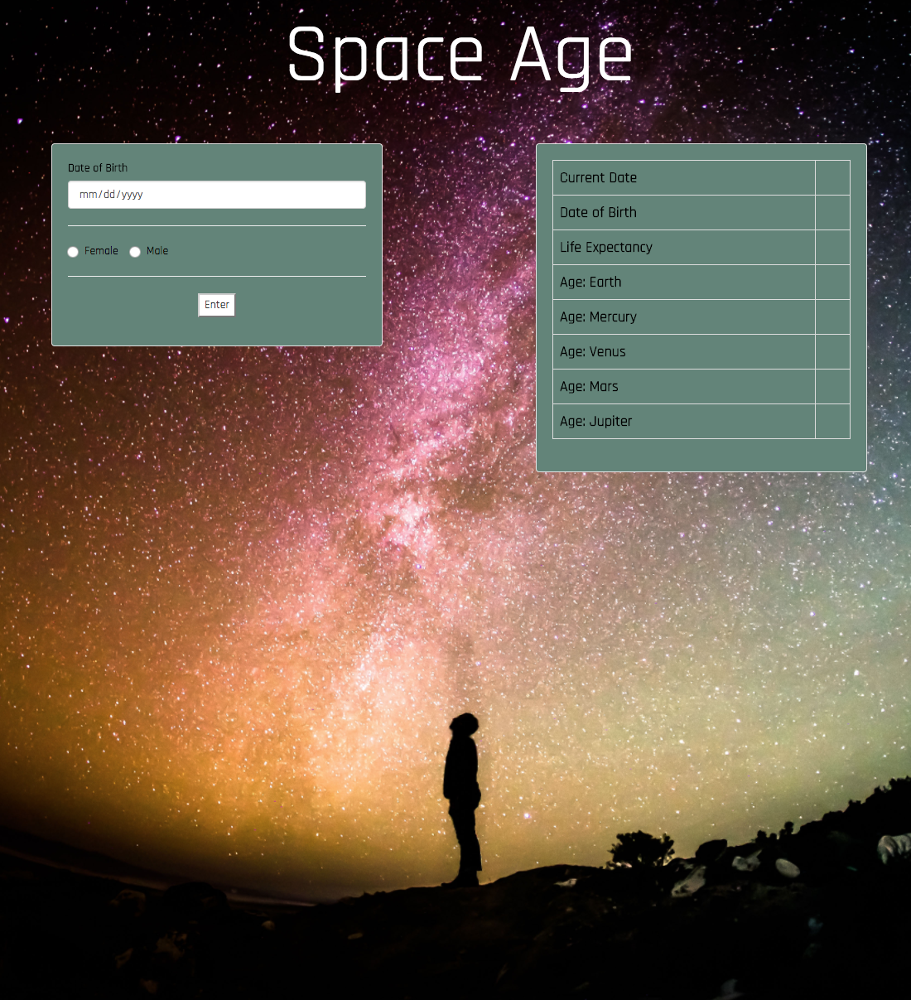
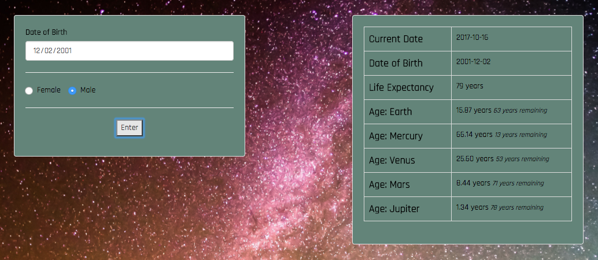
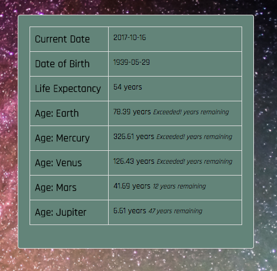
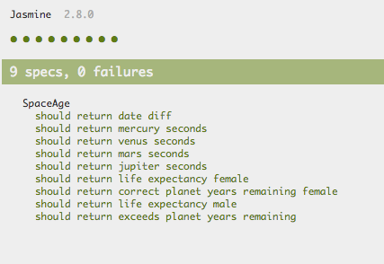

# Space Age Calculator

##### Epicodus Section: JavaScript Week BDD with Jasmine/Karma

### By Jessica Sheridan

## Description

Enter your birthdate and see how old you would be on a different planet. A solar year
lasts 365 days on planet Earth, however varies from planet to planet. Mercury solar
year lasts only 88 days.The calculator determines how many years a user has left to live on each planet
by determining the user's life expectancy based on their sex and the decade which they were
born.

## Test Plan

| Behavior      | Input | Output |
| ------------- | ------------- | ------------- |
| Calculate Earth Years into seconds| earthYears  | seconds |
| Calculate difference between 2 dates | YYYY-mm-dd diff YYYY-mm-dd| y-m-d |
| Return age earthling in Mercury Years| earthAge | planetAge |
| Return age earthling in Venus Years| earthAge | planetAge |
| Return age earthling in Mars Years| earthAge | planetAge |
| Return age earthling in Jupiter Years| earthAge | planetAge |
| Determine User Life Expectancy | age,birthyear  |  |
| How many years left on each Planet | lifeExpectancy-PlanetAge |  |
| Record if user has Exceeded LE on a planet| lifeExpectancy-PlanetAge | Exceeds! |

## Setup
 * % git clone https://github.com/jessicakenney/space-age.git  
 * % cd space-age
 * % npm install
 * % bower install
 * % gulp build
 * % gulp serve

## Testing

* % npm test

## Support and Contact details
email with any questions: jessicakenney@yahoo.com,

## Known Issues/Bugs

## Technologies Used
JavaScript, ES6,Karma,Jasmine

### Legal
This software is licensed under MIT Copyright (c) 2017 Jessica Sheridan
